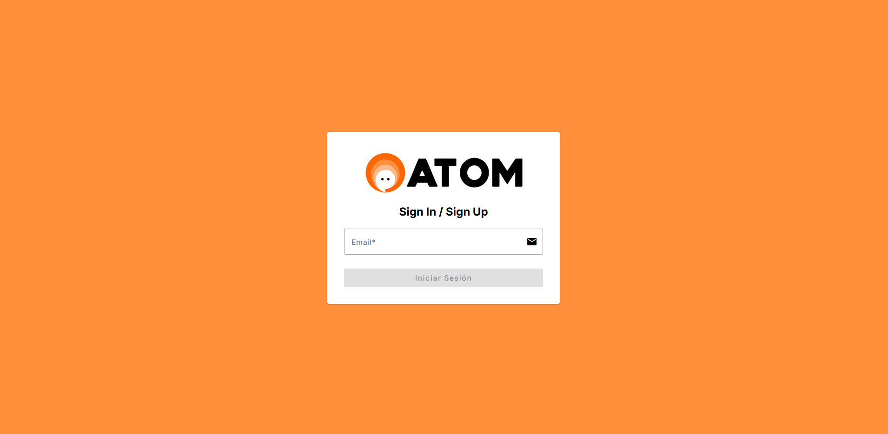
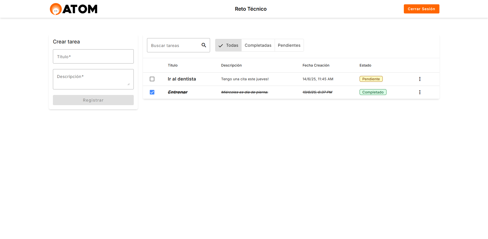

# 📋 Task Manager - Frontend (Angular)

 
 


Aplicación de gestión de tareas con autenticación por email y operaciones CRUD. Conectada a un backend en Firebase Cloud Functions.

## 🚀 Demo

[](https://task-manager-challenge.web.app/login)

<div style="display: flex; gap: 15px; justify-content: center; margin: 20px 0;">
  
  
</div>

## 🎯 Características

- **Autenticación simplificada**:
  - Login con solo email
  - Auto-creación de usuario si no existe
- **Gestión completa de tareas**:
  - ✅ Listas/Crear/Editar/Eliminar tareas
  - 🗓️ Ordenación automática por fecha
  - 🔍 Filtrado por titulo y estado (completadas/pendientes)
- **Notificaciones** con feedback visual
- **Diseño responsive** con Angular Material
- **Arquitectura reactiva** usando Angular Signals
- **Material Design** con Angular Material

## 🛠️ Tecnologías

| Tecnología       | Uso                              |
|------------------|----------------------------------|
| Angular 17       | Framework principal              |
| RxJS & Signals   | Manejo de estados y streams      |
| Angular Material | Componentes UI                   |
| Firebase         | Hosting y backend (Cloud Functions) |
| TypeScript       | Tipado estático                  |

## 🏗️ Estructura del Proyecto

```bash
├── src/
│   ├── app/
│   │   ├── core/
│   │   │   ├── guards/
│   │   │   ├── interceptors/
│   │   │   ├── models/
│   │   │   └── services/
│   │   ├── modules/
│   │   │   ├── auth/
│   │   │   └── tasks/
│   │   ├── shared/
│   │   │   └── components/
│   │   ├── app.component.html
│   │   ├── app.component.scss
│   │   ├── app.component.spec.ts
│   │   ├── app.component.ts
│   │   ├── app.config.ts
│   │   └── app.routes.ts
│   └── assets/
└── ...
```

## Cómo Empezar
- Node.js v20+
- Angular CLI
- Cuenta de Firebase


## Instalación
1. Clonar repositorio:

```bash
git clone https://github.com/JavierExeni/frontend-task-manager.git
cd frontend-task-manager
```

2. Instalar dependencias:

```bash
# Instalar dependencias
npm install

# Servidor de desarrollo
ng serve -o

# Construir para producción
ng build

# Ejecutar tests
ng test

# Linting
ng lint
```

3. Configurar entorno:

```bash
export const environment = {
  production: false,
  apiUrl: "http://..."
};
```

## Despliegue

1. Build de producción:

```bash
ng build --configuration production
```

2. Desplegar a Firebase Hosting:

```bash
firebase deploy
```
